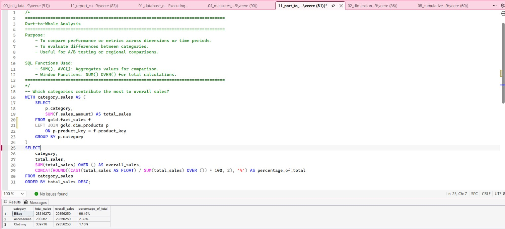
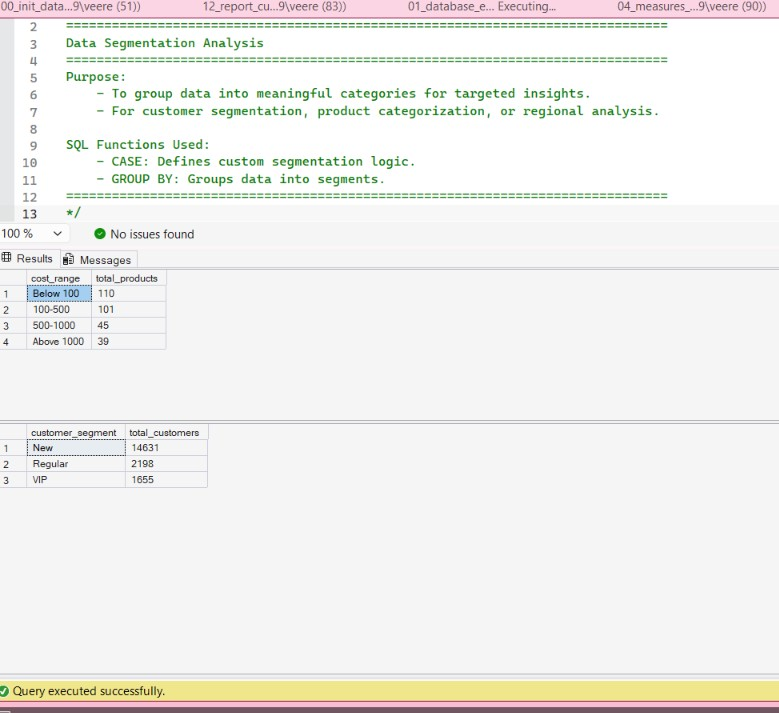
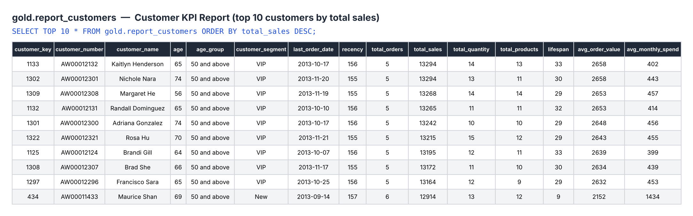

# SQL Data Analytics Project

This project builds a small **SQL Server data warehouse** from customer, product, and sales data, then uses SQL to analyze sales performance, customer behavior, and product performance. It covers loading CSV files with `BULK INSERT`, exploring the data, and building reusable reporting views.

> **About this project:** Completed as my final project for **IS 3063 – Database Management for Information Systems** at the University of Texas at San Antonio (UTSA). The dataset was provided by my professor.

## Project Goal

Create a clean, structured Gold layer that can be queried for business analysis, such as sales trends, customer behavior, and product performance.

## Tools Used

- SQL Server
- SQL Server Management Studio (SSMS)
- GitHub

## Skills Demonstrated

- Database and schema creation, table design, and bulk data loading (`BULK INSERT`)
- Joins across fact and dimension tables (star schema)
- Aggregations with `GROUP BY` (`SUM`, `COUNT`, `AVG`)
- Common Table Expressions (CTEs) and subqueries
- Window functions: `RANK()`, `LAG()`, `SUM() OVER()`, `AVG() OVER()`
- Conditional logic with `CASE` for customer and product segmentation
- Date functions: `DATEDIFF()`, `DATETRUNC()`, `YEAR()`, `FORMAT()`
- Building reporting views with KPIs (`CREATE VIEW`)

## Key Findings

- **$29.4M in total sales** across **27,659 orders** and **18,484 customers** (Dec 2010 – Jan 2014).
- **Bikes drive the business:** Bikes account for **96.5%** of revenue. Accessories (2.4%) and Clothing (1.2%) contribute very little, which makes the company heavily dependent on one category.
- **Top products are all one model:** the 5 highest-revenue products are all **Mountain-200** variants, each bringing in about $1.3M.
- **Lowest performers are small add-ons**, such as Racing Socks and Patch Kits, each with under $10K in total sales.
- **2013 was the strongest year:** sales reached **$16.3M** (up from $5.8M in 2012), and active customers jumped from about 3,300 to over 17,400. (2010 and 2014 contain only partial data.)
- **Most customers are new:** 14,631 customers (79%) are **New** (less than 12 months of history), 2,198 are **Regular**, and 1,655 are **VIP** (12+ months and over $5,000 spent). Turning new buyers into repeat customers is the biggest growth opportunity.
- **The United States is the largest market** with 7,482 customers, followed by Australia (3,591).

## Screenshots

**Category contribution to total sales** (`11_part_to_whole_analysis.sql`)



**Product cost ranges and customer segments** (`10_data_segmentation.sql`)



**Customer KPI report** (`12_report_customers.sql`): top 10 customers by total sales from the `gold.report_customers` view



> `age` and `recency` are calculated with `GETDATE()`, so those values change depending on the date the query is run.

## Database Structure

The project creates a database called `DataWarehouseAnalytics` and a schema called `gold`.

| Table | Purpose | Rows Loaded |
|---|---|---:|
| `gold.dim_customers` | Customer demographic and account information | 18,484 |
| `gold.dim_products` | Product, category, and cost information | 295 |
| `gold.fact_sales` | Sales transactions, dates, quantities, and amounts | 60,398 |

## Project Files

```text
sql-data-analytics-project/
├── images/
│   ├── category_sales.jpg
│   ├── customer_segmentation.jpg
│   └── report_customers_kpis.png
├── datasets/
│   └── csv-files/
│       ├── dim_customers.csv
│       ├── dim_products.csv
│       └── fact_sales.csv
├── scripts/
│   ├── 00_init_database.sql
│   ├── 01_database_exploration.sql
│   ├── 02_dimensions_exploration.sql
│   ├── 03_date_range_exploration.sql
│   ├── 04_measures_exploration.sql
│   ├── 05_magnitude_analysis.sql
│   ├── 06_ranking_analysis.sql
│   ├── 07_change_over_time_analysis.sql
│   ├── 08_cumulative_analysis.sql
│   ├── 09_performance_analysis.sql
│   ├── 10_data_segmentation.sql
│   ├── 11_part_to_whole_analysis.sql
│   ├── 12_report_customers.sql
│   └── 13_report_products.sql
└── README.md
```

## How to Run the Project

1. Download or clone this repository.
2. Open `scripts/00_init_database.sql` in SSMS.
3. In each `BULK INSERT` statement, replace the placeholder with the full path to the matching CSV file in `datasets/csv-files/` on **your** computer.

   | Placeholder | File |
   |---|---|
   | `PASTE_FULL_PATH_TO_gold.dim_customers.csv_HERE` | `dim_customers.csv` |
   | `PASTE_FULL_PATH_TO_gold.dim_products.csv_HERE` | `dim_products.csv` |
   | `PASTE_FULL_PATH_TO_gold.fact_sales.csv_HERE` | `fact_sales.csv` |

   Example:

   ```sql
   FROM 'PASTE_FULL_PATH_TO_gold.dim_customers.csv_HERE'
   ```

4. Run the complete script.
5. SQL Server will create the database, create the `gold` schema and tables, and load the CSV data.
6. Run the analysis scripts (`01`–`13`) in order to explore the data and build the report views.

## What the Setup Script Does

- Removes the existing `DataWarehouseAnalytics` database, if it already exists
- Creates a new `DataWarehouseAnalytics` database
- Creates the `gold` schema
- Creates the customer, product, and sales tables
- Loads the three CSV files into those tables using `BULK INSERT`

> **Warning:** The setup script drops and recreates the database each time it runs. Any data previously saved in `DataWarehouseAnalytics` will be deleted.

## Analysis Scripts

| Script | What it does |
|---|---|
| `01_database_exploration.sql` | Lists tables and columns in the database |
| `02_dimensions_exploration.sql` | Explores unique countries, categories, and products |
| `03_date_range_exploration.sql` | Finds order date range and customer age range |
| `04_measures_exploration.sql` | Calculates key business metrics (sales, quantity, orders, customers) |
| `05_magnitude_analysis.sql` | Groups customers, products, and revenue by dimension |
| `06_ranking_analysis.sql` | Ranks top and bottom products and customers |
| `07_change_over_time_analysis.sql` | Tracks sales trends by year and month |
| `08_cumulative_analysis.sql` | Calculates running totals and moving averages |
| `09_performance_analysis.sql` | Compares yearly product sales to average and prior year |
| `10_data_segmentation.sql` | Segments products by cost and customers into VIP / Regular / New |
| `11_part_to_whole_analysis.sql` | Shows each category's share of total sales |
| `12_report_customers.sql` | Creates the `gold.report_customers` view with customer KPIs |
| `13_report_products.sql` | Creates the `gold.report_products` view with product KPIs |
